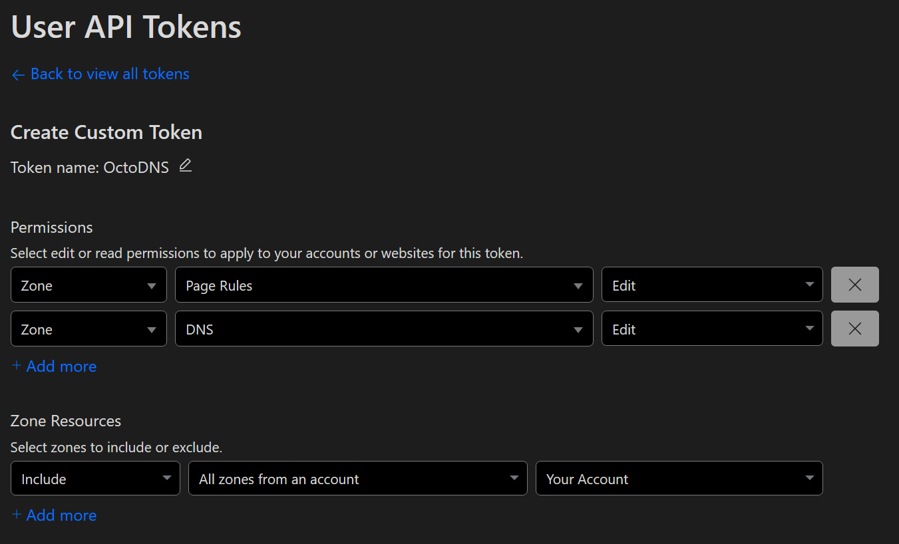

## Cloudflare provider for octoDNS

An [octoDNS](https://github.com/octodns/octodns/) provider that targets [Cloudflare](https://www.cloudflare.com/dns/).

### Installation

#### Command line

```
pip install octodns-cloudflare
```

#### requirements.txt/setup.py

Pinning specific versions or SHAs is recommended to avoid unplanned upgrades.

##### Versions

```
# Start with the latest versions and don't just copy what's here
octodns==0.9.14
octodns-cloudflare==0.0.1
```

##### SHAs

```
# Start with the latest/specific versions and don't just copy what's here
-e git+https://git@github.com/octodns/octodns.git@9da19749e28f68407a1c246dfdf65663cdc1c422#egg=octodns
-e git+https://git@github.com/octodns/octodns-cloudflare.git@ec9661f8b335241ae4746eea467a8509205e6a30#egg=octodns_cloudflare
```

### Configuration

```yaml
providers:
  cloudflare:
    class: octodns_cloudflare.CloudflareProvider
    # Your Cloudflare account email address (not needed if using token)
    # setting email along with an API Token will raise an error.
    email: env/CLOUDFLARE_EMAIL
    # The API Token or API Key.
    # Required permissions for API Tokens are Zone:Read, DNS:Read and DNS:Edit.
    # Page Rules:Edit is required for managing Page Rules (URLFWD) records.
    token: env/CLOUDFLARE_TOKEN
    # Optional. Filter by account ID in environments where a token has access
    # across more than the permitted number of accounts allowed by Cloudflare.
    account_id: env/CLOUDFLARE_ACCOUNT_ID
    # Import CDN enabled records as CNAME to {}.cdn.cloudflare.net. Records
    # ending at .cdn.cloudflare.net. will be ignored when this provider is
    # not used as the source and the cdn option is enabled.
    #
    # See: https://support.cloudflare.com/hc/en-us/articles/115000830351
    #cdn: false
    # Manage Page Rules (URLFWD) records
    # pagerules: true
    # Optional. Default: 4. Number of times to retry if a 429 response
    # is received.
    #retry_count: 4
    # Optional. Default: 300. Number of seconds to wait before retrying.
    #retry_period: 300
    # Optional. Default: 50. Number of zones per page.
    #zones_per_page: 50
    # Optional. Default: 100. Number of dns records per page.
    #records_per_page: 100
    # Optional. Default: 120. Lowest TTL allowed to be set.
    # A different limit for (non-)enterprise zone applies.
    # See: https://developers.cloudflare.com/dns/manage-dns-records/reference/ttl
    #min_ttl: 120
    # Optional. Default: false. Set auto-ttl to true for all records by default.
    #auto_ttl: false
```

Note: The "proxied" flag of "A", "AAAA" and "CNAME" records can be managed via the YAML provider like so:

```yaml
name:
    octodns:
        cloudflare:
            proxied: true
            # auto-ttl true is implied by proxied true, but can be explicitly
            # configured to be more complete
            #auto-ttl: true
    # with proxied=true, the TTL here will be ignored by CloudflareProvider
    ttl: 120
    type: A
    value: 1.2.3.4
```

Note: All record types support "auto" ttl, which is effectively equivalent to 300s.

```yaml
name:
    octodns:
        cloudflare:
            auto-ttl: true
    # with proxied=true, the TTL here will be ignored by CloudflareProvider
    ttl: 120
    type: A
    value: 1.2.3.4
```

### Support Information

#### Records

CloudflareProvider supports A, AAAA, ALIAS, CAA, CNAME, DS, LOC, MX, NAPTR, NS, PTR, SPF, SRV, SSHFP, TXT, and URLFWD. There are restrictions on CAA tag support.

#### Root NS Records

CloudflareProvider does not supports root NS record management. They can partially be managed in the API, errors are thrown if you include the Cloudflare name servers in the values, but the system completely ignores the values set and serves up its own regardless.

#### Dynamic

CloudflareProvider does not support dynamic records.

#### Required API Token Permissions

Required Permissions for API Token are Zone:Read, DNS:Read, and DNS:Edit.  
Page Rules:Edit is also required for managing Page Rules (URLFWD) records, otherwise an authentication error will be raised.

**Important Note:** When using a CloudFlare token you should **NOT** provide an email address or you will receive an error.

An example when using Page Rules (URLFWD) records -



#### TTL

Cloudflare has a different minimum TTL for enterprise and non-enterprise zones. See the [documentation](https://developers.cloudflare.com/dns/manage-dns-records/reference/ttl) for more information.
In the past the CloudflareProvider had a fixed minimum TTL set to 120 seconds and for backwards compatibility this is the current default.

### Processors

| Processor | Description |
|--|--|
| [ProxyCNAME](/octodns_cloudflare/processor/proxycname.py) | Allows Cloudflare proxied records to be used on other providers without exposing the proxied record value. Points other providers to the relevant `.cdn.cloudflare.net` subdomain. Useful to allow split authority with a secondary provider while still retaining Cloudflare benefits for certain records. |
| [TtlToProxy ](/octodns_cloudflare/processor/ttl.py) | Ensure Cloudflare's proxy status is setup depending on the TTL set for the record. This can be helpful for `octodns_bind.ZoneFileSource` or the like. |

### Developement

See the [/script/](/script/) directory for some tools to help with the development process. They generally follow the [Script to rule them all](https://github.com/github/scripts-to-rule-them-all) pattern. Most useful is `./script/bootstrap` which will create a venv and install both the runtime and development related requirements. It will also hook up a pre-commit hook that covers most of what's run by CI.
